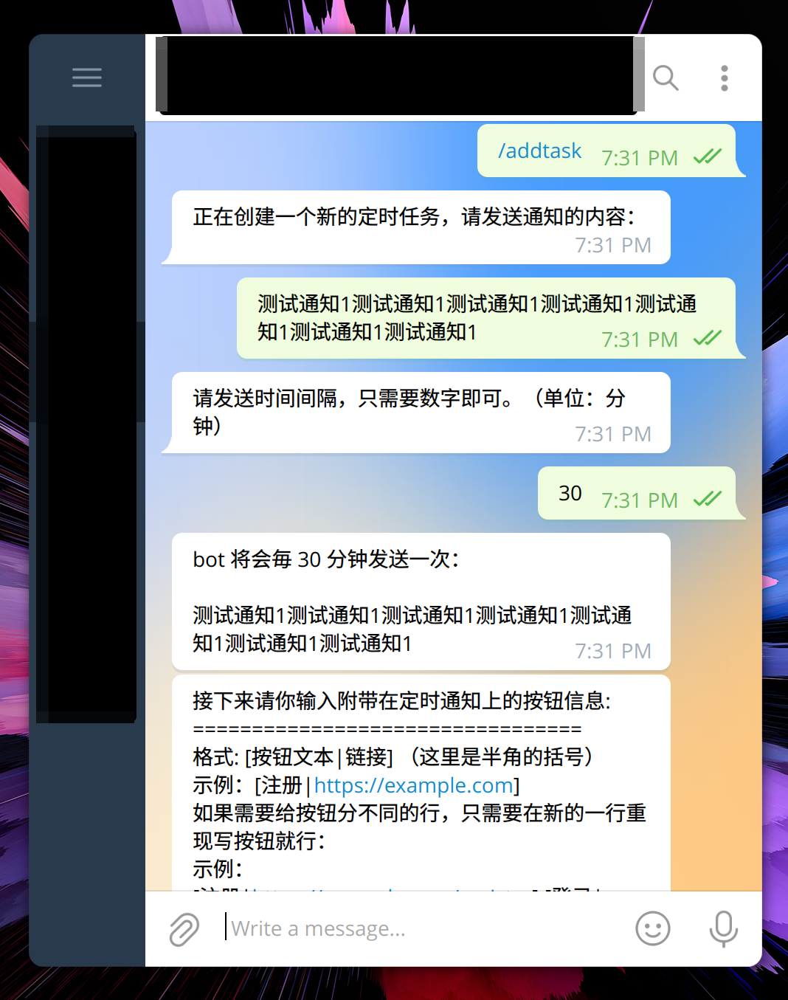
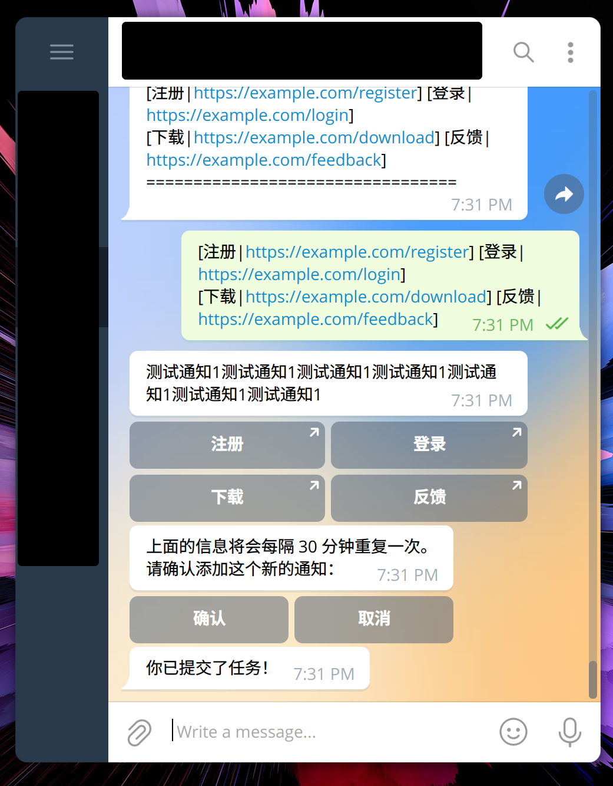
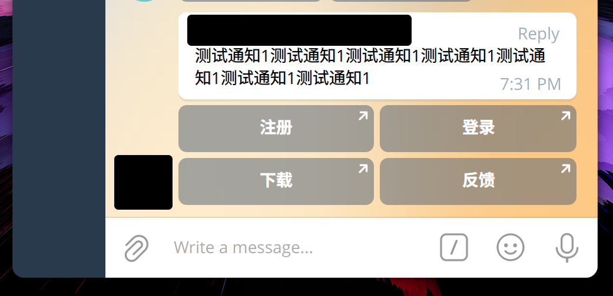

# Notify Bot

A simple and easy to use bot for sending notification in schedule.





<br>
<sub>
There is a wizard for adding task,
multiple task with different repeat interval is also supported
</sub>

## Usage

- Download program from [actions](https://github.com/Avimitin/tg-schedule-notify-bot/actions)[^1].
or [compile it from source](#Compile-from-source).

[^1]: Click the latest actions with ✅ icons, and download file from artifacts panel.

- Add configuration

```bash
export TELOXIDE_TOKEN=abcde:12345
export NOTIFY_BOT_MAINTAINERS=12345678
export NOTIFY_BOT_ADMINS=12345678
export NOTIFY_BOT_GROUPS=-123456,-7891011
```

| var                      | explain                                                                             |
|--------------------------|-------------------------------------------------------------------------------------|
| `TELOXIDE_TOKEN`         | Telegram BOT API Token. Apply it from `@BotFather`                                  |
| `NOTIFY_BOT_ADMINS`      | A list of user id. Use for maintain the bot. Separate multiple id with `,`          |
| `NOTIFY_BOT_GROUPS`      | A list of chat id for bot to send notification. Separate multiple id with `,`       |
| `NOTIFY_BOT_MAINTAINERS` | A list of user id to manage the bot or add new admin. Separate multiple id with `,` |

- Execute it

```bash
./notify-bot
```

- Or run the bot as a daemon

```bash
# Install exec
sudo cp notify-bot /usr/bin/notify-bot

# Create systemd service file
echo "[Unit]
Description=Foo

[Service]
ExecStart=/usr/bin/notify-bot
Restart=on-failure
RestartSec=30s
Environment=TELOXIDE_TOKEN=abcde:12345
Environment=NOTIFY_BOT_MAINTAINERS=12345678
Environment=NOTIFY_BOT_GROUPS=-123456,-789654,-321456
Environment=NOTIFY_BOT_ADMINS=12345,54321

[Install]
WantedBy=multi-user.target" > /etc/systemd/system/notify-bot.service

# Run the service
sudo systemctl start notify-bot
```

## Compile from source

```bash
# Install cargo toolchains
curl --proto '=https' --tlsv1.2 -sSf https://sh.rustup.rs | sh

# Get the source code
git clone --depth=1 https://github.com/Avimitin/notify-bot

# Compile it
cd notify-bot
cargo build --release

# Install it
sudo cp ./target/release/notify-bot /usr/bin/notify-bot


# OR
# you can just install it with subcommand install
cargo install --path .
# It will compile the program and put exec to $HOME/.cargo/bin
```

## Commands

```text
/help — 显示这条帮助消息
/start — 显示这条帮助消息
/addtask — 添加一个新的播报任务。
/listtask — 列出当前所有的播报任务
/deltask — 删除指定的任务。
/addadmin — 添加一个新的 bot 管理员（维护者专用）
/deladmin — 删除 bot 管理员（维护者专用）
/addgroup — 添加一个新的通知群
/delgroup — 删除通知群
```
