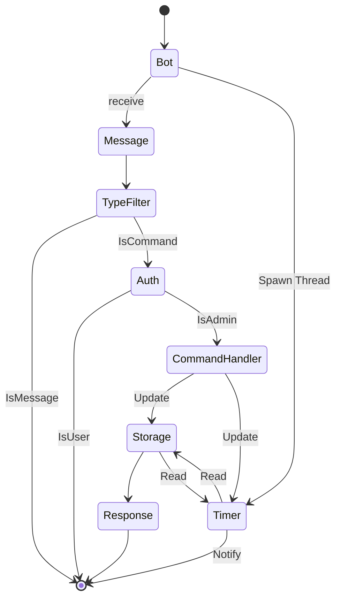
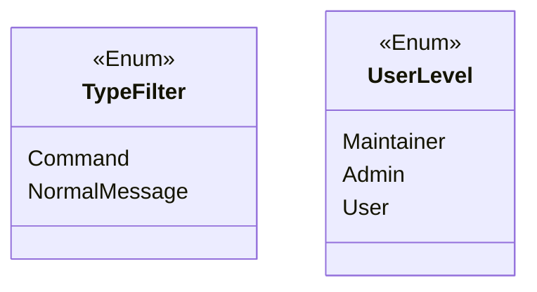

# the design

## User levels

1. Maintainer (lv99)
2. Admins (lv1)
3. Users (lv0)

## Diagram





## Message

Bot will maintain a message queue for notification.
When timer send a tick, bot will pick message from message queue and send it.

## Response for different level

### User

```text
user: /start

bot: ... (No response)
```

### Maintainer

- Available commands:

| commands       | function           |
|----------------|--------------------|
| /grant `{uid}` | Create a new admin |

> Maintainer can also use admin commands too

- How

  1. By `$NOTIFY_BOT_MAINTAINER` env variable

### Admins

- Available commands

| commands              | function                |
|-----------------------|-------------------------|
| /enqueue `[msg]`      | Add message into queue  |
| /list                 | List queue              |
| /remove `[id]`        | Remove nth msg          |
| /clean                | Clean the message queue |
| /settime `{datetime}` | Set the Timer           |

- How

  1. Grant by command `/grant`
  2. Set by `$NOTIFY_BOT_ADMINS` env variable
  ```bash
  # Separate by comma `;`
  NOTIFY_BOT_ADMINS="123;456;789"
  ```
